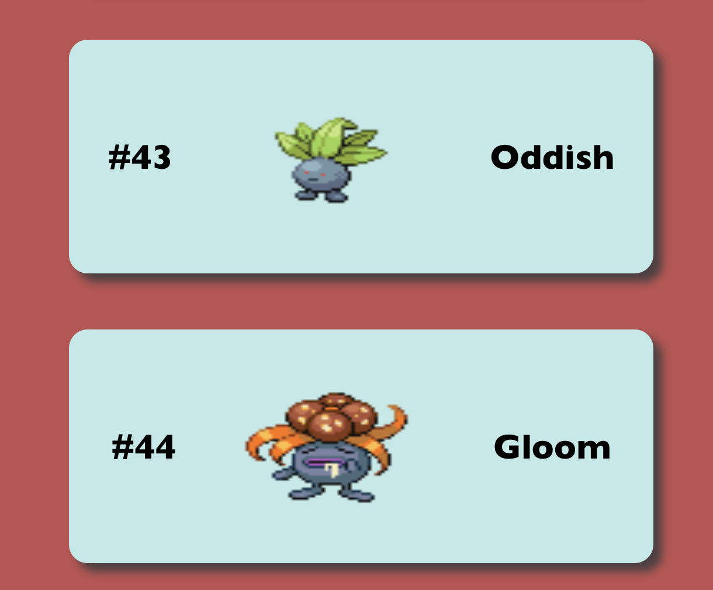
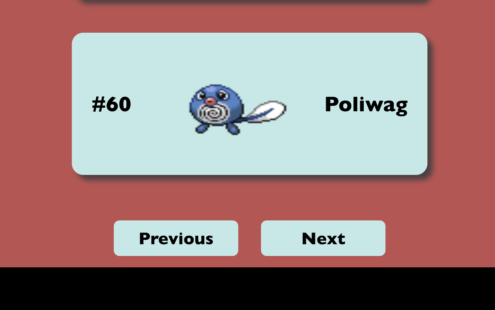
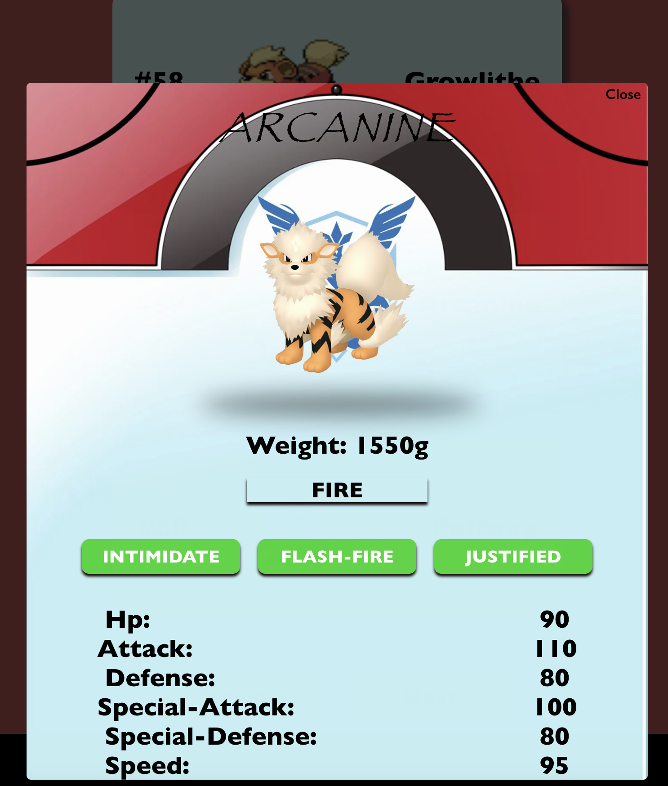

# Custom PokéDex with Modals

<h2 align='center'>Welcome to my own Custom PokDex!

</h2>

_________
## The PokéDex
__________
The UI is set up to display a group of Pokémons as small rectangular cards.

<p align ='center'>

The App is set up to load 20 Pokémons per render and the next/previous set of Pokémons can be rendered using the buttons at the botton of the APP.

<p align ='center'>


When a Pokémon card is click, A popup window will appear showing more in-depth details about that Pokémon like so:


<p align ='center'>

-----------
The PokéDex is created using a ReactJS framework and 
`create-react-app`. 

All the data generated in this PokéDex is taken from [PokeAPI.co](https://www.PokeAPI.co) using the `pokemon` endpoint. The PokéDex data is retrieved from the API using an Axios Librar, which is an open source library for HTML and Browsers, via `const (someConst) = async await get(someEndPoint)` and the `useEffect` hook from React. To install the Axios Library and it's dependencies, do the following:<br/> 
- cd into the react app from the terminal, then run the command 
`npm i axios` which will 

-   Axios's syntax differs from React `fetch()` because in Axios, instead of calling: 
```
fetch('someEndPoint')
.then(response =>response.json)
.then(json=>console.log(json))
```
- you run this instead (in this case I did asycn)

```
const getPokeData=async(res)=>{
    setState(someState)
    }
```

- in doing so you get a much cleaner code that pulls data from an API.


We then pass the data once it has been properly fetched from [PokeAPI.co](https://www.PokeAPI.co) to State through the `useState` hook from React.
__________


## The PokeDex: State and Components


Here you will find how the data is passed to State and then passed to the children components to render the data to the UI and to the Modal.

The generalized map of the PokéDex is below:

```
(Top Level)
Index.js
|
|-------App.js
           |
           |
        Main.js-----|(Path to Lowest Level Components)
                    |-----PokemonImageCard.js
                    |
                    |-----PokemonDetails.js
                    |
                    |-----Header.js & Footer.js
                    

```
_______________

## The PokeDex: State, Data, Rendering to UI


- First the State constants are set up like so in Main.Js:

```
const [pokeData, setPokeData] = useState([]);
const [loading, setLoading] = useState(true);
const [url, setUrl] = useState('https://pokeapi.co/api/v2/pokemon?limit=20');
const [nextUrl, setNextUrl] = useState();
const [prevUrl, setPrevUrl] = useState();
const [pokeDexData, setPokeDexData] = useState();
const [pokeModal, setPokeModal] = useState(false)
```

* Then the data is fectched from [PokeAPI.co](https://www.PokeAPI.co) and set to pokeData State.
    * The PokeAPI requires a second axios request/promise nested in the first in order to get data about individual Pokémons.
        * The top level request will pull a large JSON object containing the Pokémons. This JSON will results which contains a `{name}`  and `{url}` for each Pokémon and sets the data to the State of `pokeData` by `setPokeData([]). 
        * The nested axios request uses the `{url}` stored in `pokeData` to to pull more data for individual Pokémon for later use in the `<PokemonDetails/>` component
    * Below is the code I set up in the working PokéDex:

```
const getPokeData=async(res)=>{
    setPokeData([])
    res.map(async(item)=>{
        const Pokemons=await axios.get(item.url)
        setPokeData(state =>{
            state=[...state, Pokemons.data]
            state.sort((a,b)=>a.id>b.id?1:-1)
            return state
        })
    })
}
```
_________________
_________
* Then another axios request is made to get the data needed to render groups of Pokémons to the Main Screen of the App. This will later be used to generate clickable Pokémon Cards. This Data will be set to various States for interactivity later.

* The Code is as follows:

```
const fetchPokeData = async() => {
    setLoading(true);
    const res = await axios.get(url);
    setNextUrl(res.data.next);
    setPrevUrl(res.data.previous);
    getPokeData(res.data.results)
    setLoading(false)
}
```
-----------
----------

* Now that that all the Axios Requests have been made. We can then apply the `useEffect()` hook to the data for the Main screen view by passing `fetchPokeData` to the hook like so:

```
useEffect(() => {
    fetchPokeData ();
}, [url])
```

* Next the State/data needed for each component can be pass to the children of Main via props and JSON destructuring. Example Below oof passing props/state:

```
<div className='MainContainer'>
<div className='PokedexContainer'>
    <PokemonImageCard onClick={()=>resetModal} 
    pokemon={pokeData} 
    loading={loading} 
    pokemonInfo={poke=>setPokeDexData(poke)}/>
```

* Example of destructuring object and receiving state/props in children component:

```
export const PokemonImageCard = ({pokemon, loading, pokemonInfo})...
```


